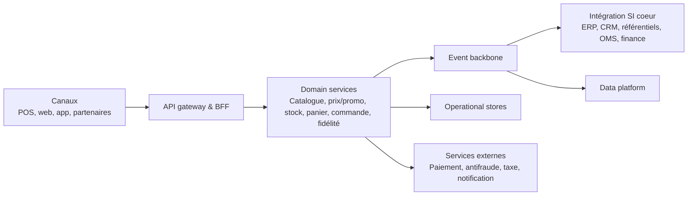

# Socle omnicanal commerce unifié

## Synthèse exécutive

- Contexte: SI commerce international fragmenté, avec redondances POS/e-commerce et flux batch nombreux.
- Enjeu principal: passer d’un assemblage local à un socle groupe modulaire, API-first et pilotable par domaine.
- Cible: un noyau omnicanal orienté capacités (stock, pricing/promo, panier, commande, fidélité, paiement), consommé par POS et e-commerce.
- Approche: migration progressive par pays et par capacité, avec coexistence maîtrisée.

---

# Lecture du contexte

## Enjeux structurants

- Harmoniser l’expérience client web/magasin sans casser l’autonomie pays.
- Unifier les données critiques en temps quasi réel (stock, client, commande, promotions).
- Réduire la dette d’intégration (batch point-à-point) et le coût de maintien.
- Soutenir les pics commerciaux avec des SLO partagés et une observabilité transverse.

---

# Questions de cadrage

## Questions clés à trancher rapidement

- Quel modèle opératoire cible: plateforme groupe centralisée ou fédération de domaines pays?
- Quelle profondeur de standardisation par capacité (produit, prix, promo, stock, fidélité)?
- Quels écarts réglementaires pays imposent des variantes locales non négociables?
- Quelle trajectoire POS: convergence fonctionnelle ou coexistence durable multi-POS?
- Quels contrats de service métier (latence, disponibilité, RTO/RPO) par parcours critique?

---

# Principes d’architecture

## Principes retenus

- API-first et event-driven pour découpler canaux, cœur métier et partenaires.
- Domain ownership clair: un propriétaire fonctionnel et technique par capacité.
- Mastership explicite des données (source de vérité unique par objet).
- Buy before build sur capacités non différenciantes (paiement, antifraude, taxe, search).
- Zero trust, privacy by design, conformité locale by default.

---

# Vision cible

## Macro-architecture cible

---

# Arbitrages structurants

## Buy vs build, SaaS vs custom

- Build: orchestration omnicanale spécifique (panier cross-canal, règles de rupture, parcours de retour).
- Buy/SaaS: paiement, antifraude, observabilité, searchandising, tax engine, CDP marketing.
- Hybride: moteur promo/fidélité selon capacité de paramétrage multi-pays et latence requise.
- Critères: time-to-market, coût de changement, réversibilité, conformité, compétence interne.

---

# Stratégie de migration

## Plan exécutable en 3 horizons

- 0-6 mois: fondation + pilote 2 pays/2 canaux avec rollback via gateway et feature flags.
- 6-12 mois: extension cluster pays, commande/retours/fidélité, réduction batch critiques.
- 12-24 mois: généralisation internationale, décommissionnements legacy et optimisation TCO.
- Go/no-go formalisé: seuils KPI explicites, rollback déclenché sur critères partagés.
## Pattern de transition

- Pattern strangler: encapsuler l’existant via API gateway puis substituer capacité par capacité.
- Priorité parcours: stock disponible, panier, commande, paiement, retours.
- Déploiement vagues: pilote pays/enseigne, extension cluster par cluster.
- Filets de sécurité: feature flags, canary releases, double run ciblé, rollback opérationnel.

---

# Approche de déploiement

## Cadre d’exécution

- Trains trimestriels alignés métier/IT, avec gouvernance d’architecture légère mais ferme.
- SLO de plateforme: latence API < 200 ms sur parcours synchrones critiques.
- DevSecOps standardisé: CI/CD, tests de contrat API, tests de charge, chaos engineering ciblé.
- Pilotage valeur: KPI business (conversion, NPS, rupture évitée) + KPI techniques (disponibilité, MTTR).

---

# Risques majeurs et parades

- Sur-standardisation groupe: préserver des extensions locales encadrées.
- Dette de migration sous-estimée: financer explicitement les chantiers de sortie legacy.
- Dérive du modèle de données: instaurer architecture board orienté données.
- Saturation des équipes pays: modèle produit avec enablement central et runbook standard.

---

# Décision attendue en comité

- Valider le modèle opératoire cible et les domaines prioritaires.
- Valider les arbitrages buy/build des capacités transverses.
- Lancer un pilote 2 pays / 2 canaux / 3 capacités critiques en 6 mois.
- Cadencer la généralisation internationale sur 18-36 mois selon dépendances legacy.
