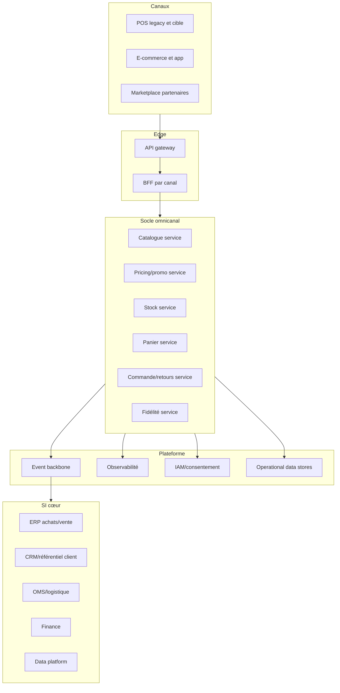

# Vision cible

## Capacités cœur du socle omnicanal

- Catalogue exploitable canal (produit, assortiment, attributs de vente).
- Pricing et promotion en temps réel, multi-pays, gouvernance des priorités.
- Stock unifié (magasin + entrepôt), promesse de disponibilité.
- Panier omnicanal persistant et finalisation cross-canal.
- Commande et retours cross-canal avec traçabilité bout en bout.
- Fidélité temps réel (earn/burn), coupons, règles locales.

---

# Macro-architecture

---

# Mapping as-is vers to-be

## Statut des briques existantes

| Brique existante | Statut cible | Cible associée | Logique |
|---|---|---|---|
| API gateway existante | Conserver | Edge | Actif stratégique déjà en place |
| Business APIs | Conserver/étendre | Core API contracts | Standardiser et versionner |
| Talend ESB et batch | Encapsuler puis réduire | Event backbone + API | Sortir du point-à-point |
| POS legacy multiples | Encapsuler puis remplacer partiel | POS cible + BFF | Transition progressive par pays |
| Plateformes e-commerce multiples | Encapsuler puis rationaliser | BFF + services core | Réduire redondances |
| OMS order in store | Conserver (interface claire) | Domaine commande | Frontière explicite avec logistique |
| Référentiels produit/client | Conserver | SI cœur master data | Source de vérité maintenue |
| Outils ponctuels redondants | Retirer | Capacités core ou SaaS groupe | Réduction TCO/dette |

---

# Positionnement des briques

## Responsabilités proposées

- Référentiels centraux: master produit/client conservés côté SI cœur.
- Socle omnicanal: logique transactionnelle temps réel orientée parcours client.
- OMS/logistique: orchestration préparation/expédition conservée hors socle.
- Data platform: analytique, pilotage et historisation non transactionnelle.

---

# Principes de conception

- Contrats API versionnés, compatibilité ascendante par défaut.
- Événements métier canoniques pour diffusion transverse.
- Idempotence et résilience systématiques sur flux critiques.
- Séparation stricte commandes synchrones (client-facing) vs asynchrones (back-office).
- Localisation par configuration: langue, devise, fiscalité, conformité.

---

# Matrice d’arbitrage

## Buy vs build vs SaaS vs custom

Barème: 1 (faible) à 5 (fort).

| Option | Valeur métier | Time-to-market | Coût 3 ans | Risque lock-in | Conformité | Score total |
|---|---:|---:|---:|---:|---:|---:|
| Build interne | 5 | 2 | 2 | 5 | 4 | 18 |
| SaaS standard | 3 | 5 | 4 | 2 | 3 | 17 |
| Produit buy on-prem/cloud | 3 | 3 | 3 | 3 | 4 | 16 |
| Custom avec intégrateur | 4 | 3 | 2 | 3 | 4 | 16 |

---

# Matrice d’arbitrage

## Décisions proposées par capacité

| Capacité | Choix | Rationale synthétique |
|---|---|---|
| Paiement multi-PSP | SaaS/Buy | Time-to-market + conformité forte |
| Antifraude web | SaaS | Expertise spécialisée et adaptation continue |
| Taxe/fiscalité | SaaS | Variabilité réglementaire internationale |
| Panier omnicanal | Build | Différenciation parcours cross-canal |
| Retours cross-canal | Build/Custom | Dépendance aux process enseigne |
| Searchandising | Buy/Hybride | Vitesse de déploiement + pilotage métier |

---

# Exigences non fonctionnelles

- Performance: API synchrones critiques < 200 ms (p95 cible).
- Disponibilité: architecture active-active logique, dégradation maîtrisée.
- Sécurité: chiffrement transit/repos, zero trust, journalisation d’audit.
- Exploitabilité: observabilité unifiée, SLI/SLO par parcours.
- Continuité: RTO/RPO alignés sur criticité métier par domaine.

---

# Gouvernance d’architecture

- Domain architecture board mensuel orienté décisions.
- Catalogue des standards (API, événements, sécurité, data contracts).
- Process d’exception limité et daté, avec plan de convergence.
- FinOps et pilotage coût-performance intégrés aux revues trimestrielles.
