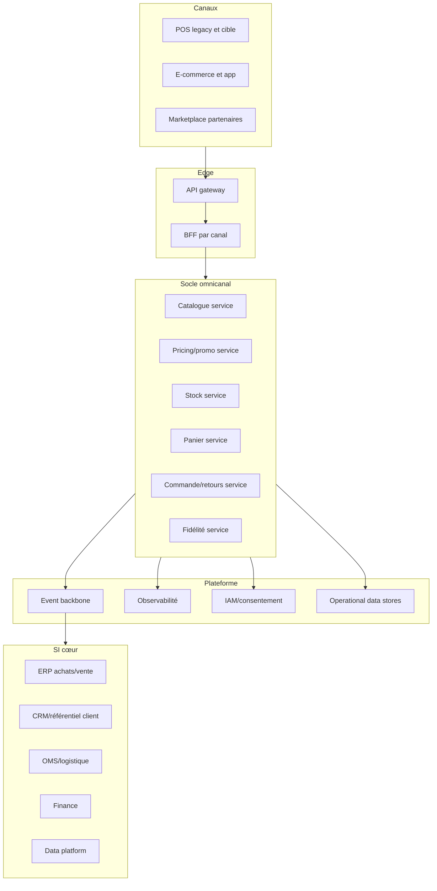

# Vision cible

## Capacités cœur du socle omnicanal

- Catalogue exploitable canal (produit, assortiment, attributs de vente).
- Pricing et promotion en temps réel, multi-pays, gouvernance des priorités.
- Stock unifié (magasin + entrepôt), promesse de disponibilité.
- Panier omnicanal persistant et finalisation cross-canal.
- Commande et retours cross-canal avec traçabilité bout en bout.
- Fidélité temps réel (earn/burn), coupons, règles locales.

---

# Macro-architecture

---

# Mapping as-is vers to-be

## Statut des briques existantes

| Brique existante | Statut cible | Cible associée | Logique |
|---|---|---|---|
| API gateway existante | Conserver | Edge | Actif stratégique déjà en place |
| Business APIs | Conserver/étendre | Core API contracts | Standardiser et versionner |
| Talend ESB et batch | Encapsuler puis réduire | Event backbone + API | Sortir du point-à-point |
| POS legacy multiples | Encapsuler puis remplacer partiel | POS cible + BFF | Transition progressive par pays |
| Plateformes e-commerce multiples | Encapsuler puis rationaliser | BFF + services core | Réduire redondances |
| OMS order in store | Conserver (interface claire) | Domaine commande | Frontière explicite avec logistique |
| Référentiels produit/client | Conserver | SI cœur master data | Source de vérité maintenue |
| Outils ponctuels redondants | Retirer | Capacités core ou SaaS groupe | Réduction TCO/dette |

---

# Positionnement des briques

## Responsabilités proposées

- Référentiels centraux: master produit/client conservés côté SI cœur.
- Socle omnicanal: logique transactionnelle temps réel orientée parcours client.
- OMS/logistique: orchestration préparation/expédition conservée hors socle.
- Data platform: analytique, pilotage et historisation non transactionnelle.

---

# Ownership par capacité

## Matrice de responsabilités

| Capacité | Owner produit | Owner technique | Système maître | SLA cible |
|---|---|---|---|---|
| Catalogue de vente | Domain lead offre | Lead engineering catalogue | Référentiel produit central | Fraîcheur < 5 min |
| Pricing/promo | Domain lead pricing | Lead engineering pricing | Moteur pricing/promo groupe | Latence p95 < 200 ms |
| Stock marchand | Domain lead stock | Lead engineering stock | ERP stock + service stock | Écart stock < 2% |
| Panier omnicanal | Domain lead checkout | Lead engineering panier | Service panier core | Disponibilité >= 99.9% |
| Commande/retours | Domain lead order | Lead engineering order | Service commande core + OMS | RTO < 30 min |
| Fidélité | Domain lead fidélité | Lead engineering fidélité | Moteur fidélité groupe | Earn/burn < 2 s |

---

# Principes de conception

- Contrats API versionnés, compatibilité ascendante par défaut.
- Événements métier canoniques pour diffusion transverse.
- Idempotence et résilience systématiques sur flux critiques.
- Séparation stricte commandes synchrones (client-facing) vs asynchrones (back-office).
- Localisation par configuration: langue, devise, fiscalité, conformité.

---

# Arbitrages buy vs build

| Capacité | Orientation | Justification |
|---|---|---|
| Paiement multi-PSP | Buy | Commodité marché, conformité, rapidité d’exécution |
| Antifraude web | Buy | Expertise spécialisée et modèle évolutif |
| Moteur taxe/fiscalité | Buy | Variabilité réglementaire internationale |
| Panier omnicanal | Build | Différenciation parcours cross-canal |
| Orchestration retours | Build/Hybride | Forte dépendance aux process enseigne |
| Searchandising | Buy/Hybride | Vitesse, pilotage métier, personnalisation |

---

# Exigences non fonctionnelles

## Contrats NFR par domaine

| Domaine | Performance | Disponibilité | Résilience | Sécurité/data |
|---|---|---|---|---|
| Stock & disponibilité | p95 < 200 ms | >= 99.9% | RTO 30 min, RPO 5 min | Traçabilité des ajustements |
| Panier & checkout | p95 < 200 ms | >= 99.95% | Dégradation sans perte panier | Chiffrement, tokenisation paiement |
| Commande & retours | p95 < 300 ms | >= 99.9% | Rejeu idempotent, DLQ | Audit complet actions sensibles |
| Fidélité & promo | p95 < 250 ms | >= 99.9% | Retry borné, compensation | Gestion consentement et opt-in |
| API edge | p95 < 150 ms | >= 99.95% | Circuit breaker et canary | IAM fédéré, WAF, rate limiting |

---

# Gouvernance d’architecture

- Domain architecture board mensuel orienté décisions.
- Catalogue des standards (API, événements, sécurité, data contracts).
- Process d’exception limité et daté, avec plan de convergence.
- FinOps et pilotage coût-performance intégrés aux revues trimestrielles.
