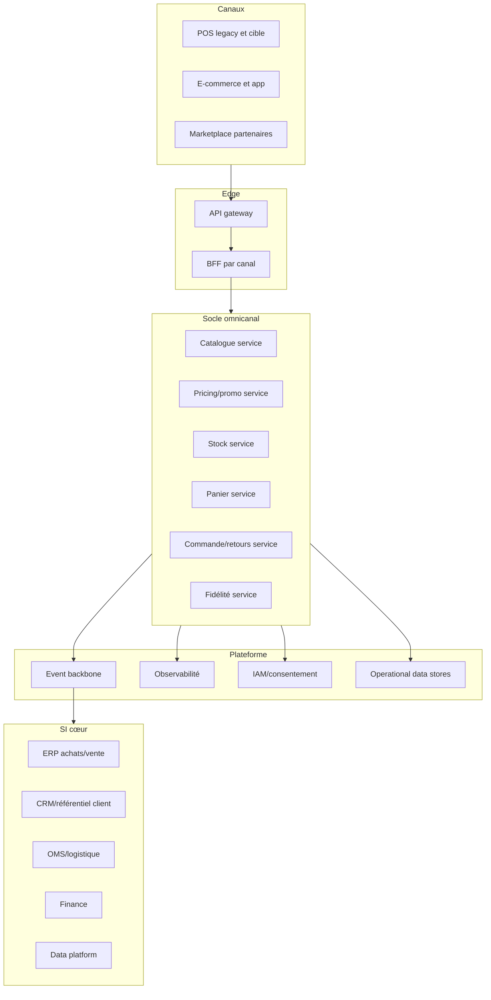

# Vision cible

## Capacités cœur du socle omnicanal

- Catalogue exploitable canal (produit, assortiment, attributs de vente).
- Pricing et promotion en temps réel, multi-pays, gouvernance des priorités.
- Stock unifié (magasin + entrepôt), promesse de disponibilité.
- Panier omnicanal persistant et finalisation cross-canal.
- Commande et retours cross-canal avec traçabilité bout en bout.
- Fidélité temps réel (earn/burn), coupons, règles locales.

---

# Macro-architecture

---

# Positionnement des briques

## Responsabilités proposées

- Référentiels centraux: master produit/client conservés côté SI cœur.
- Socle omnicanal: logique transactionnelle temps réel orientée parcours client.
- OMS/logistique: orchestration préparation/expédition conservée hors socle.
- Data platform: analytique, pilotage et historisation non transactionnelle.

---

# Principes de conception

- Contrats API versionnés, compatibilité ascendante par défaut.
- Événements métier canoniques pour diffusion transverse.
- Idempotence et résilience systématiques sur flux critiques.
- Séparation stricte commandes synchrones (client-facing) vs asynchrones (back-office).
- Localisation par configuration: langue, devise, fiscalité, conformité.

---

# Arbitrages buy vs build

| Capacité | Orientation | Justification |
|---|---|---|
| Paiement multi-PSP | Buy | Commodité marché, conformité, rapidité d’exécution |
| Antifraude web | Buy | Expertise spécialisée et modèle évolutif |
| Moteur taxe/fiscalité | Buy | Variabilité réglementaire internationale |
| Panier omnicanal | Build | Différenciation parcours cross-canal |
| Orchestration retours | Build/Hybride | Forte dépendance aux process enseigne |
| Searchandising | Buy/Hybride | Vitesse, pilotage métier, personnalisation |

---

# Exigences non fonctionnelles

- Performance: API synchrones critiques < 200 ms (p95 cible).
- Disponibilité: architecture active-active logique, dégradation maîtrisée.
- Sécurité: chiffrement transit/repos, zero trust, journalisation d’audit.
- Exploitabilité: observabilité unifiée, SLI/SLO par parcours.
- Continuité: RTO/RPO alignés sur criticité métier par domaine.

---

# Gouvernance d’architecture

- Domain architecture board mensuel orienté décisions.
- Catalogue des standards (API, événements, sécurité, data contracts).
- Process d’exception limité et daté, avec plan de convergence.
- FinOps et pilotage coût-performance intégrés aux revues trimestrielles.
