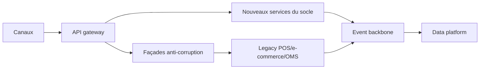

# Stratégie de migration

## Principes

- Prioriser les parcours à valeur client et risque maîtrisé.
- Isoler l’existant derrière des façades API stables.
- Remplacer par capacité, pas par application monolithique.
- Piloter la dette de coexistence avec jalons de décommissionnement.

---

# Coexistence legacy

## Schéma de transition

---

# Plan exécutable

## Horizon 0 à 6 mois

- Jalons: contrats API, événements canoniques, observabilité minimale, sécurité baseline.
- Périmètre: pilote 2 pays, 2 canaux, stock + panier + checkout.
- Critères de réussite: latence p95 cible tenue, stabilité en pic, zéro incident critique bloquant.
- Rollback: bascule contrôlée vers parcours legacy via feature flags et routage gateway.

---

# Plan exécutable

## Horizon 6 à 12 mois

- Jalons: commande/retours cross-canal, fidélité temps réel, industrialisation CI/CD multi-domaines.
- Périmètre: extension par cluster pays et rationalisation e-commerce redondant.
- Critères de réussite: baisse incidents majeurs, amélioration conversion, réduction flux batch critiques.
- Rollback: retour partiel par capacité (commande, retours, fidélité) sans rollback global.

---

# Plan exécutable

## Horizon 12 à 24 mois

- Jalons: décommissionnements legacy prioritaires, standard groupe stabilisé, optimisation coût-performance.
- Périmètre: généralisation internationale avec variantes locales encadrées.
- Critères de réussite: réduction TCO, baisse dette technique, adoption cible par pays.
- Rollback: plan de continuité limité aux fonctions critiques et fenêtre de retour définie.

---

# Gouvernance opérationnelle

## RACI de référence

| Décision | A | R | C | I |
|---|---|---|---|---|
| Standard API/événement | CTO groupe | Lead architecte domaine | Pays IT lead, sécurité | PMO programme |
| Priorisation capacité | Sponsor métier groupe | Product manager domaine | Direction pays | Équipes run |
| Go/no-go vague pays | Directeur programme | Release manager | Ops pays, sécurité, finance | COMEX projet |
| Décommissionnement legacy | CTO groupe | Responsable plateforme | Pays IT lead | PMO |

---

# Gouvernance opérationnelle

## Comitologie, cadence et KPI décisionnels

- Comitologie: architecture board (mensuel), steering programme (hebdo), go/no-go release (par vague).
- Cadence: incréments trimestriels avec revues de valeur mensuelles.
- KPI décisionnels: disponibilité, latence p95, MTTR, taux d’incident critique, décommissionnement effectif.

---

# Dimension internationale

## Template pays

- Bloc global obligatoire: API contracts, sécurité, observabilité, modèle de données canonique.
- Bloc local paramétrable: fiscalité, moyens de paiement, langue, devise, mentions légales.
- Bloc local spécifique sous dérogation: cas réglementaires non couverts par paramétrage.

---

# Dimension internationale

## Variantes autorisées et non autorisées

| Domaine | Autorisé localement | Non autorisé localement |
|---|---|---|
| Fiscalité | Règles taxe et éco-participation | Changer le modèle de données canonique |
| Paiement | Moyens de paiement et PSP homologués | Contourner les contrôles antifraude groupe |
| Expérience | Langue, contenus, parcours éditoriaux | Modifier contrats API core |
| Fidélité/promo | Paramétrage des règles pays | Dupliquer le moteur central hors gouvernance |

---

# Décisions de lancement

- Valider le pilote initial: périmètre, pays, canaux, critères de succès.
- Sécuriser le budget de transformation et de sortie legacy.
- Installer la gouvernance produit/architecture et les rituels d’arbitrage.
- Engager l’exécution sur 3 horizons: 6 mois, 12 mois, 24 mois.
