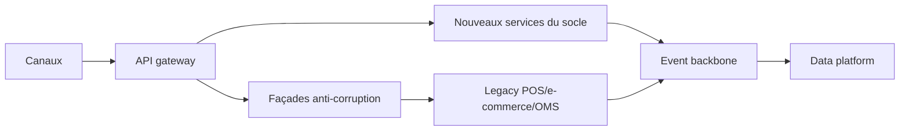

# Stratégie de migration

## Principes

- Prioriser les parcours à valeur client et risque maîtrisé.
- Isoler l’existant derrière des façades API stables.
- Remplacer par capacité, pas par application monolithique.
- Piloter la dette de coexistence avec jalons de décommissionnement.

---

# Plan de migration

## Vagues proposées

1. Fondation: contrats API, événements canoniques, observabilité, sécurité.
2. Parcours vente: stock disponible, panier, checkout/paiement.
3. Post-achat: commande, retours cross-canal, service client.
4. Extension: fidélité avancée, promotions complexes, optimisation pays.

---

# Coexistence legacy

## Schéma de transition

---

# Déploiement

## Modèle industriel

- CI/CD standard par domaine avec quality gates.
- Tests automatiques: unitaires, contrats API, non-régression parcours.
- Tests de charge sur pics commerciaux avant chaque vague.
- Déploiement progressif: canary, blue/green selon criticité.

---

# Exploitation et fiabilité

## Run cible

- SRE transverse + équipes domaine responsables de bout en bout.
- Runbooks incidents standardisés et exercices de reprise planifiés.
- Mesure continue des SLO et error budgets par capacité.
- Gestion proactive de la qualité de données (fraîcheur, complétude, cohérence).

---

# Gestion internationale

## Cadre de déploiement multi-pays

- Core global commun, variantes locales par configuration.
- Templates de déploiement pays (taxes, paiements, langue, devise).
- Process de certification locale avant go-live.
- Ordonnancement des pays par complexité réglementaire et dépendances legacy.

---

# KPI de pilotage

| Axe | KPI |
|---|---|
| Business | conversion, panier moyen, taux de rupture visible |
| Opérations | délai de déploiement, incident majeur, MTTR |
| Technique | latence p95, disponibilité, taux d’erreur API |
| Transformation | taux de décommissionnement legacy, adoption pays |

---

# Décisions de lancement

- Valider le pilote initial: périmètre, pays, canaux, critères de succès.
- Sécuriser le budget de transformation et de sortie legacy.
- Installer la gouvernance produit/architecture et les rituels d’arbitrage.
- Engager l’exécution sur 3 horizons: 6 mois, 12 mois, 24+ mois.
